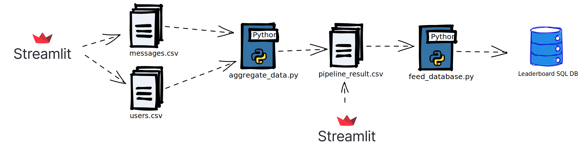
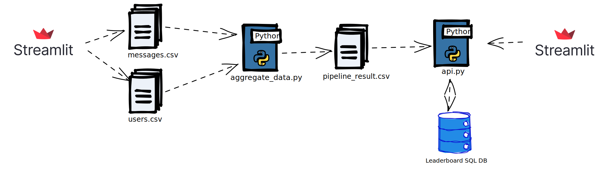
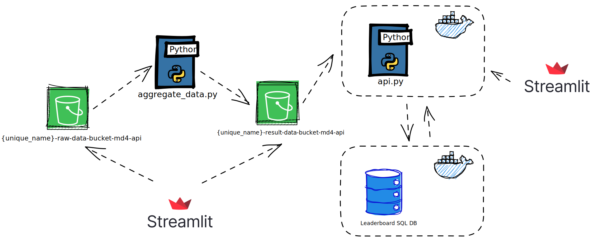
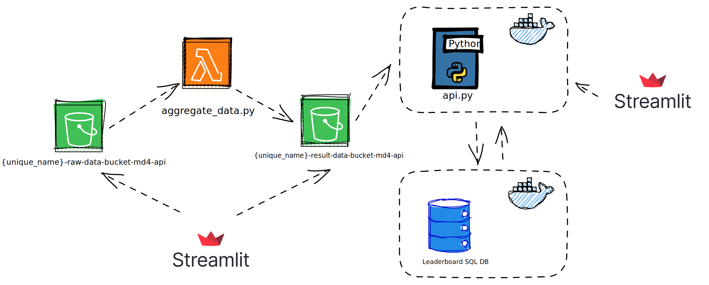

# TP - Final - Data Pipelines

**Members:**
| Aghiles ABBACHE | aghiles.abbache@gmail.com | ABBACHE_Aghiles
| Hikmet BENYAHYA | h_benyahia@hetic.eu | hikmet96
| Ahmed tahar amar | ahmedtaharamar90@gmail.com|ahmedtaharamar
| Anis BOUMAAZA |anis.boumaaza.enp@gmail.com|anisboumdata
| Safaa Boulaich | safaa.boulaich@hotmail.fr| safaratee
| Achraf Abrit | a_abrit@hetic.eu| achrafabrit
| Guelaz Lahouari | l_guelaz@hetic.eu| lao


### ⚙ Requirements

- The AWS account provided by our great teacher ♥.
- The AWS CLI tool: [https://aws.amazon.com/cli](https://aws.amazon.com/cli)
- When logged in your AWS account, be sure to switch the language to English with bottom left language link

 

> ⚠️ All the actions you will execute on your account will be billed to your teacher account so follow carefully the instructions to not occur unexpected costs (all the actions of your account are monitored and traceable by your teacher) ⚠️
> 


## 🥅  Goal

We are simulating a scenario, where our customer is the owner of customer support center and want a way to rank the most active clients by the number of message received from them.

During this exercise, we will have to create 4 iterations of the same data pipeline from a pipeline that is manual and simple to an automated one deployed partially in the cloud.

What makes our script so powerfull:

- It handles CLI arguments: You can pass as arguments the name of the files you want to work on and in this example we have users.csv and messages.csv and storage the resulted data in  pipeline_result.csv :

### py aggregate_data.py users.csv messages.csv pipeline_result.csv

To feed the database we can pass the name of the database and the csv as args like this: 

### py feed_database.py AWS.db pipeline_result.csv


## 🎯 First Iteration



The components of this data pipeline iteration are:

- 2 CSV files `messages.csv` and `users.csv` (you can find samples in the `/samples` folder)
- A Python script `aggregate_data.py`:
    - This script handles 3 mandatory arguments:
        - `messages_path`: path to messages data file
        - `users_path`: path to user data file
        - `output_path`:  path to output the result of the script
    - This script must group messages by `user_id` and rank them by messages received in ascending order and produce a new CSV file called `pipeline_result.csv` at the path specified by the `output_path` argument
    - The script must manage errors and exit the program if anything bad happens with an explanatory output
- A Python script `feed_database.py`:
    - This script handles 3 mandatory arguments:
        - database_uri
    - stores `pipeline_result.csv` data into a SQL database in table called `leaderboard`
    - this script must SQLAlchemy to design the table and interact with the database
    - a migration script must be available to setup the database by using Alembic

This data pipeline is pretty manual and will require the user to launch the 2 python scripts on the CSV files to execute it.


## 🎯 Second iteration





For this iteration, everything stays the same as the first iteration, except for `feed_database.py` that becomes a Flask API in a file called `api.py`

This API will have two endpoints:

- `POST /feed`:
    - this endpoint must accept a JSON payload with a field called `data_path` that is a valid path to the `pipeline_result.csv` generated by the `aggregate_data.py` script
    - this endpoint will open the CSV file and store the data in the previous following the same behavior as the `feed_database.py` script
- `GET /leaderboard`:
    - this endpoint must query the leaderboard table of the database and return the results in a JSON response following this format:
    
    ```json
    {
      "leaderboard": [
    	{
    		"user_id": 1,
    		"messages": 20,
    		"name": "Andre"
    	}, 
    	...
    }
    ```
    

Also to make the setup of pipeline easier, specify a Docker command to create container for our database with any SQL technology you choose fit with a docker volume to persist the data.

- The docker command (update the command below):

```json
docker run -d -p 5432:5432 --name my-database -v /path/to/data:/var/lib/postgresql/data -e POSTGRES_USER=myuser -e POSTGRES_PASSWORD=mypassword postgres

```
This command will create a container named "my-database" using the PostgreSQL image. It will expose port 5432, and you can map it to the same port on your host machine (change /path/to/data to the actual path where you want to store the database data). The -e POSTGRES_USER=myuser and -e POSTGRES_PASSWORD=mypassword options specify the username and password for the PostgreSQL database.

Our users can now interact with our application through an API instead of using SQL queries but we want to be able to interact with remote data so we are going to store all our CSVs in the cloud with AWS S3.


## 🎯 Third data pipeline



For this iteration, we keep the same behavior as before except that we will store our CSVs in 2 S3 buckets and we will update the `aggregate_bucket_data.py` script and our API to interact with the buckets.

Here are the different components:

- A new S3 bucket called `{unique_name}-raw-data-bucket-md4-api` that will store the `messages.csv` and the `users.csv` as 2 objects at the root of the bucket
- A new S3 bucket called `{unique_name}-result-data-bucket-md4-api` that will store the `pipeline_result.csv` file
- The script `aggregate_bucket_data.py`:
    - must be updated to use gather the data from the `{unique_name}-raw-data-bucket-md4-api` with the boto3 package and a IAM user that has enough permissions to read the bucket
    - must be updated to store the result of the aggregation in `{unique_name}-result-data-bucket-md4-api` in `pipeline_result.csv` object (replance it if it is already present in the bucket) with the boto3 package and a IAM user that has enough permissions to read/write on the bucket
- For the API `api.py:`
    - A new endpoint `POST /feed/s3` must be implemented:
        - this endpoint must accept a JSON payload with a field called `s3_bucket` that is a valid S3 bucket name
        - It will need to fetch the `s3_bucket` and check if a `pipeline_result.csv` object is present at the root and apply the same logic as the existing `POST /feed` to store the data in our database

To continue to improve the project setup, your will create a `Dockerfile` for the API so that we can easily launch it. 
Specify below these commands:

- The docker build command to build an image called `pipeline-flask-api` from the `Dockerfile`:
- The docker run command to create a container from the `pipeline-flask-api` image, that map your local post 3000 to the port 3000 of the container


"""In the same directory as our Dockerfile, we created a file named requirements.txt and list all the Python packages required for our API, including flask, boto3, and any other dependencies.

We built the Docker image using the following command:

### docker build -t pipeline-flask-api .

This command will build an image called pipeline-flask-api using the Dockerfile in the current directory. The -t flag specifies the name and optionally a tag for the image.

Once the image is built, you can create a container from the image and map port 3000 of the container to your local port 3000 using the following command:

### docker run -p 3000:3000 pipeline-flask-api

This command creates and runs a container from the pipeline-flask-api image. The -p flag maps the local port 3000 to the port 3000 of the container.

Ensure that your Flask API code (api.py) and any other necessary files are in the same directory as the Dockerfile before building the image.

Now we can access your API at http://localhost:3000 and make requests to the /feed/s3 endpoint as per the specified requirements."""


## 🎯 Fourth data pipeline



For this last iteration, we want to automate the first part of our data pipeline in the Cloud with AWS Lambda.

You must complete these steps:

- Create a Lambda called `aggregate-lambda-md4-api` in the `eu-west-3` region
- Attach the Lambda to a S3 trigger listening the S3 bucket `{unique_name}-raw-data-bucket-md4-api`
- Update the lambda execution IAM Role permissions to have a policy allowing your Lambda to read/write to the `{unique_name}-result-data-bucket-md4-api` bucket
- Upload the code  `aggregate_bucket_data.py` script to the Lambda
- Test and validate your Lambda behavior by updating the `messages.csv` or the `users.csv` file in the `{unique_name}-raw-data-bucket-md4-api` with new data and check that the `pipeline_result.csv` file is updated accordingly in the `{unique_name}-result-data-bucket-md4-api`


# To automate the first part of your data pipeline using AWS Lambda, you can follow these steps:

# Step 1: Create a Lambda Function

Go to the AWS Management Console and navigate to the Lambda service.
Choose "Create function" and select "Author from scratch".
Provide a name for your Lambda function, such as aggregate-lambda-md4-api.
Select the desired runtime environment, such as Python 3.9.
Choose an existing or create a new execution role for the Lambda function that has permissions to access S3.
Click on "Create function" to create the Lambda.

# Step 2: Configure the S3 Trigger

In the Lambda function configuration, click on "Add trigger".
Select the S3 trigger and choose the {unique_name}-raw-data-bucket-md4-api bucket as the source bucket.
Configure the trigger settings as per your requirements.
Save the trigger configuration.

# Step 3: Update IAM Role Permissions

Go to the IAM service in the AWS Management Console.
Find the IAM role associated with your Lambda function.
Update the role's permissions to allow read/write access to the {unique_name}-result-data-bucket-md4-api bucket.
You can attach an appropriate S3 access policy to the role.

# Step 4: Upload the Lambda Code

Create a Python script called aggregate_bucket_data.py with the necessary logic to process the S3 data.
In the Lambda function configuration, go to the "Code" tab.
Select the appropriate method to upload the code (e.g., uploading a .zip file or directly editing inline code).
Upload the aggregate_bucket_data.py script as the Lambda function code.

# Step 5: Test and Validate the Lambda

Modify the messages.csv or users.csv file in the {unique_name}-raw-data-bucket-md4-api bucket to include new data.
Check that the pipeline_result.csv file is correctly updated in the {unique_name}-result-data-bucket-md4-api bucket.
Monitor the Lambda function's logs and any relevant CloudWatch metrics to ensure the desired behavior.

By following these steps, you'll create an AWS Lambda function that is triggered when new objects are added to the source S3 bucket. The Lambda function will execute the aggregate_bucket_data.py script to process the data and update the pipeline_result.csv file in the destination S3 bucket.

# Thanks chatgpt for this last part ♥♥♥ 
## ⚙️ Delivery

- Create your own Github repository and invite  `@AJRdev` as a maintainer
- Keep your Github repository code clean, I don’t want to see any unnecessary files (.pycache…) or draft files in your repository.
- Document your code as much as possible and fill information in the `Documentation` section below if you feel the need ⬇️

---

## 📖 Documentation


---

## 🌻 Resources

- Different concepts learned through the module: [https://ajrdev.notion.site/MD4-API-Docker-Cloud-2023-3b2becb7c6d54cada22a016f7f8ed84f](https://www.notion.so/MD4-API-Docker-Cloud-2023-3b2becb7c6d54cada22a016f7f8ed84f)
- Understand how to use boto3 with S3: [https://realpython.com/python-boto3-aws-s3/](https://realpython.com/python-boto3-aws-s3/)
- A exhaustive list of IAM permissions for all AWS services: [https://iam.cloudonaut.io/](https://iam.cloudonaut.io/)